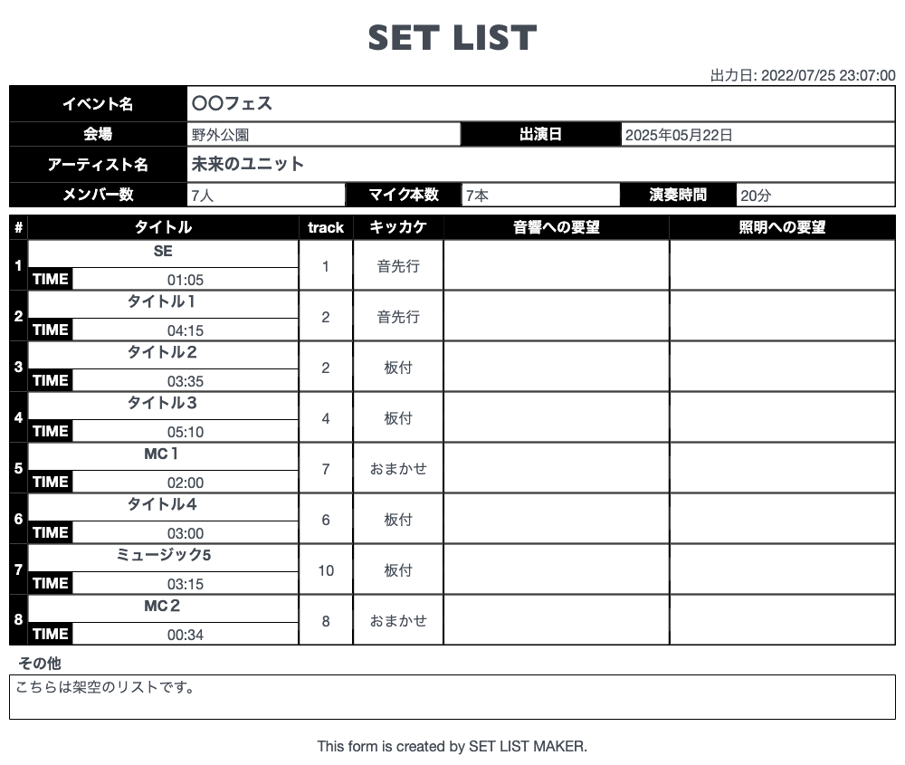

# セットリストメーカー

## 1. 概要
* アーティストがライブイベントに出演する際に音響さんや照明さんへの要望を記載するためのフォームの生成ツール。

## 2. 生成イメージ

## 3. 画面概要

### 3.1 トップ画面
* タイトル「セットリストメーカー」
* 「作成する」ボタン

### 3.2 編集画面

#### 3.2.1 イベント概要編集フォーム
* イベント名入力欄(任意)
* 会場名入力欄（任意）
* 開催日時選択欄（任意）
* アーティスト名入力欄（必須）
* ステージ持ち時間（必須）
* メンバー人数入力欄（任意）
* マイク使用本数選択欄（任意）

#### 3.2.2 曲入力画面
* Track番号（任意）
* 曲名入力欄（必須）
* 時間選択欄（任意）
* きかっけ入力欄（任意）
* 人数選択欄（任意）(無記入はメンバー人数が入る)
* 音響入力欄（任意）
* 照明入力欄（任意）
* 前へボタン
* 追加or次へボタン
* 入力完了ボタン

### 3.3 出力画面
* 生成画像（アーティスト名_出演日(YYYY/MM/DD).jpeg)
* pdf出力ボタン
* csv出力ボタン
* メールで送信ボタン
* ラインで送信ボタン
* 広告欄
* ホームボタン
